# CharacterOS — Entity Relationship Diagram

## Core Hierarchy: Character → World → Content

```
                              ┌─────────┐
                              │  User   │
                              └────┬────┘
                                   │ 1:N
                                   ▼
┌──────────────────────────────────────────────────────────────────────────┐
│                           CHARACTER LAYER                                 │
│                                                                          │
│  ┌─────────────┐  1:1  ┌──────────────────┐  1:1  ┌──────────────┐     │
│  │  Character  │──────▶│ CharacterBible   │       │  Occupation  │◀────┤
│  └──────┬──────┘       └──────────────────┘       └──────┬───────┘     │
│         │ 1:1                                            │ N:1         │
│         │                                                ▼             │
│         │                                         ┌──────────────┐     │
│         │  1:N                                    │   Location   │     │
│         ├────────────────────────────────────────▶│  (workplace) │     │
│         │                                         └──────────────┘     │
│         │  1:N                                                         │
│         ├──▶ Routine[]                                                 │
│         ├──▶ Hobby[]                                                   │
│         └──▶ Outfit[]                                                  │
└─────────┼──────────────────────────────────────────────────────────────┘
          │ 1:1
          ▼
┌──────────────────────────────────────────────────────────────────────────┐
│                             WORLD LAYER (MOAT)                           │
│                                                                          │
│  ┌─────────────┐  1:1  ┌─────────────┐  1:N  ┌─────────────┐          │
│  │    World    │──────▶│  Residence  │──────▶│    Room     │          │
│  └──────┬──────┘       └─────────────┘       └──────┬──────┘          │
│         │                                            │                 │
│         │ 1:N                                        │ 1:N             │
│         ├──▶ Location[]  (cafes, gyms, malls, etc.)  ├──▶ Asset        │
│         ├──▶ Friend[]                                │                 │
│         ├──▶ FamilyMember[]                          ▼                 │
│         ├──▶ Pet[]                              ┌─────────┐           │
│         └──▶ WorldEvent[]                       │ Prompt  │           │
│                  │                               └─────────┘           │
│                  │ N:1 (optional)                                      │
│                  └──────────────────────────────▶ Location             │
└──────────────────────────────────────────────────────────────────────────┘
          │
          │ Character also owns directly:
          ▼
┌──────────────────────────────────────────────────────────────────────────┐
│                            CONTENT LAYER                                  │
│                                                                          │
│  Character ──1:N──▶ Asset ──N:1──▶ Prompt                             │
│       │                                                                  │
│       ├──1:N──▶ Campaign ──1:N──▶ ContentIdea ──1:1──▶ Post           │
│       │              │                    │                              │
│       │              │                    └──────────────▶ Reel        │
│       │              │                                                   │
│       │              └──N:1──▶ BrandDeal ──1:N──▶ ProductPromotion    │
│       │                                                                  │
│       ├──1:N──▶ Post                                                     │
│       ├──1:N──▶ Reel                                                     │
│       └──1:N──▶ ProductPromotion                                         │
└──────────────────────────────────────────────────────────────────────────┘
```

---

## Full ER Diagram (Mermaid)

```mermaid
erDiagram
    User ||--o{ Character : owns

    Character ||--|| CharacterBible : has
    Character ||--|| World : lives_in
    Character ||--|| Occupation : works_as
    Character ||--o{ Routine : follows
    Character ||--o{ Hobby : enjoys
    Character ||--o{ Outfit : wears
    Character ||--o{ Asset : vaults
    Character ||--o{ Prompt : defines
    Character ||--o{ Campaign : plans
    Character ||--o{ Post : publishes
    Character ||--o{ Reel : creates
    Character ||--o{ ProductPromotion : promotes
    Character ||--o{ BrandDeal : partners

    World ||--|| Residence : contains
    World ||--o{ Location : has_favorites
    World ||--o{ Friend : knows
    World ||--o{ FamilyMember : related_to
    World ||--o{ Pet : owns
    World ||--o{ WorldEvent : experiences

    Residence ||--o{ Room : has_spaces

    Room ||--o{ Asset : contains
    Room }o--o| Prompt : visual_dna

    Location ||--o{ Asset : photographed_at
    Location ||--o{ ContentIdea : sets_scene
    Location ||--o{ Routine : happens_at
    Location ||--o{ WorldEvent : hosts
    Location }o--o| Prompt : visual_dna

    Occupation }o--o| Location : workplace

    Friend }o--o| Prompt : portrait_dna
    Outfit }o--o| Prompt : fashion_dna

    Campaign ||--o{ ContentIdea : includes
    Campaign ||--o{ Post : generates
    Campaign ||--o{ Asset : produces
    Campaign }o--o| BrandDeal : sponsored_by

    ContentIdea ||--o| Post : becomes
    ContentIdea ||--o| Reel : becomes
    ContentIdea }o--o| Location : filmed_at
    ContentIdea }o--o| Outfit : styled_with
    ContentIdea }o--o| WorldEvent : tied_to

    BrandDeal ||--o{ ProductPromotion : drives
    BrandDeal ||--o{ Campaign : funds

    Prompt ||--o{ Asset : generates

    Character {
        uuid id PK
        uuid userId FK
        string name
        string slug
        string avatarUrl
        int age
        datetime birthday
        enum status
        enum creationMode
        string contentNiche
        string brandVoice
        json socialMediaStyle
        json metadata
        datetime createdAt
        datetime updatedAt
    }

    CharacterBible {
        uuid id PK
        uuid characterId FK
        json identity
        json personality
        json home
        json socialCircle
        json lifestyle
        json fashion
        json goals
        json dailyRoutine
        json favoritePlaces
        int version
        datetime generatedAt
        text rawMarkdown
    }

    World {
        uuid id PK
        uuid characterId FK
        string name
        string city
        string country
        string timezone
        json culture
        text summary
        boolean isComplete
        datetime createdAt
        datetime updatedAt
    }

    Residence {
        uuid id PK
        uuid worldId FK
        enum type
        string neighborhood
        string address
        int floor
        float squareMeters
        enum interiorStyle
        text exteriorDescription
        text viewDescription
        text description
        string imageUrl
        uuid promptId FK
    }

    Room {
        uuid id PK
        uuid residenceId FK
        enum type
        string name
        text description
        json designDetails
        text story
        string imageUrl
        uuid promptId FK
        int sortOrder
    }

    Location {
        uuid id PK
        uuid worldId FK
        enum type
        string name
        text description
        text relationship
        text story
        string address
        enum visitFrequency
        string imageUrl
        uuid promptId FK
        boolean isFavorite
    }

    Friend {
        uuid id PK
        uuid worldId FK
        string name
        int age
        string occupation
        json personality
        enum relationship
        text description
        text story
        text appearance
        string imageUrl
        uuid promptId FK
    }

    FamilyMember {
        uuid id PK
        uuid worldId FK
        string name
        enum relation
        int age
        string occupation
        json personality
        text description
        boolean livesWith
        text appearance
        string imageUrl
    }

    Pet {
        uuid id PK
        uuid worldId FK
        string name
        enum species
        string breed
        json personality
        text description
        text appearance
        string imageUrl
    }

    WorldEvent {
        uuid id PK
        uuid worldId FK
        string title
        enum type
        datetime date
        boolean recurring
        text description
        text contentOpportunity
        uuid locationId FK
    }

    Occupation {
        uuid id PK
        uuid characterId FK
        string title
        string company
        string industry
        string income
        enum workStyle
        text description
        uuid workplaceLocationId FK
    }

    Routine {
        uuid id PK
        uuid characterId FK
        enum type
        string title
        json schedule
        text description
        uuid locationId FK
    }

    Hobby {
        uuid id PK
        uuid characterId FK
        string name
        enum skillLevel
        enum frequency
        text description
        text contentPotential
    }

    Outfit {
        uuid id PK
        uuid characterId FK
        string name
        enum occasion
        text description
        json items
        json brands
        string hairStyle
        string makeup
        string imageUrl
        uuid promptId FK
    }

    Asset {
        uuid id PK
        uuid characterId FK
        enum type
        string name
        string url
        string thumbnailUrl
        string mimeType
        int fileSize
        int width
        int height
        string[] tags
        uuid locationId FK
        uuid roomId FK
        uuid campaignId FK
        uuid promptId FK
        json metadata
        datetime createdAt
    }

    Prompt {
        uuid id PK
        uuid characterId FK
        string name
        enum type
        enum template
        text positivePrompt
        text negativePrompt
        string model
        json parameters
        int version
        boolean isCanonical
        datetime createdAt
    }

    Campaign {
        uuid id PK
        uuid characterId FK
        string title
        enum type
        text goal
        enum[] platform
        datetime startDate
        datetime endDate
        enum status
        json brief
        uuid brandDealId FK
        datetime createdAt
    }

    ContentIdea {
        uuid id PK
        uuid characterId FK
        uuid campaignId FK
        uuid worldEventId FK
        string title
        enum type
        enum platform
        text concept
        uuid locationId FK
        uuid outfitId FK
        datetime scheduledDate
        enum status
        text caption
        string[] hashtags
        text imagePrompt
        int sortOrder
    }

    BrandDeal {
        uuid id PK
        uuid characterId FK
        string brandName
        string product
        decimal budget
        json deliverables
        text guidelines
        enum status
        datetime startDate
        datetime endDate
    }

    Post {
        uuid id PK
        uuid characterId FK
        uuid campaignId FK
        uuid contentIdeaId FK
        enum platform
        enum format
        text caption
        string[] hashtags
        text altText
        uuid[] assetIds
        datetime scheduledAt
        datetime publishedAt
        enum status
        json exportBundle
    }

    Reel {
        uuid id PK
        uuid characterId FK
        uuid campaignId FK
        uuid contentIdeaId FK
        enum platform
        string title
        text caption
        string[] hashtags
        string videoUrl
        string thumbnailUrl
        int duration
        enum format
        enum provider
        text script
        enum status
        datetime scheduledAt
    }

    ProductPromotion {
        uuid id PK
        uuid characterId FK
        uuid brandDealId FK
        string productName
        text productDescription
        text campaignGoal
        text targetAudience
        enum platform
        decimal budget
        json contentPlan
        json deliverables
        enum status
    }
```



---

## Relationship Paths (Navigation Examples)

### "Where does Mimi live?"
```
Character → World → Residence → Room[]
```

### "Who are Mimi's friends?"
```
Character → World → Friend[]
```

### "Where does Mimi go on Sunday mornings?"
```
Character → Routine[] (type: WEEKEND/MORNING) → Location
Character → World → Location[] (visitFrequency: WEEKLY)
Character → Hobby[] → content context
```

### "Generate a coffee shop reel for Mimi"
```
Character → World → Location (type: CAFE)
Character → CharacterBible → lifestyle.cafes
Character → Outfit[] (occasion: CASUAL)
Character → Prompt[] (canonical location + character prompts)
→ ContentIdea → Reel
```

### "Generate Nike product promotion"
```
Character → ProductPromotion (product: Nike Air Max)
Character → World → Location[] (lifestyle settings)
Character → Outfit[] (CASUAL, GYM)
Character → BrandDeal → Campaign → ContentIdea[] → Post[] + Reel[]
```

### "What would Mimi wear for a luxury dinner?"
```
Character → CharacterBible → fashion
Character → Outfit[] (occasion: FORMAL)
Character → World → Location[] (type: RESTAURANT, NIGHTLIFE)
→ AI Memory Query (no new entity, reads existing graph)
```

---

## Cascade Delete Rules

| Parent Deleted | Children Action |
|----------------|-----------------|
| User | Cascade → all Characters and entire graph |
| Character | Cascade → Bible, World, Occupation, Routines, Hobbies, Outfits, Assets, Prompts, Campaigns, Posts, Reels, Promotions, BrandDeals |
| World | Cascade → Residence, Locations, Friends, Family, Pets, WorldEvents |
| Residence | Cascade → Rooms |
| Campaign | Set null on ContentIdea.campaignId; keep generated Posts |
| BrandDeal | Set null on Campaign.brandDealId |
| Prompt | Set null on referencing Location/Room/Outfit/Asset.promptId |
| Location | Set null on Routine.locationId, ContentIdea.locationId |
