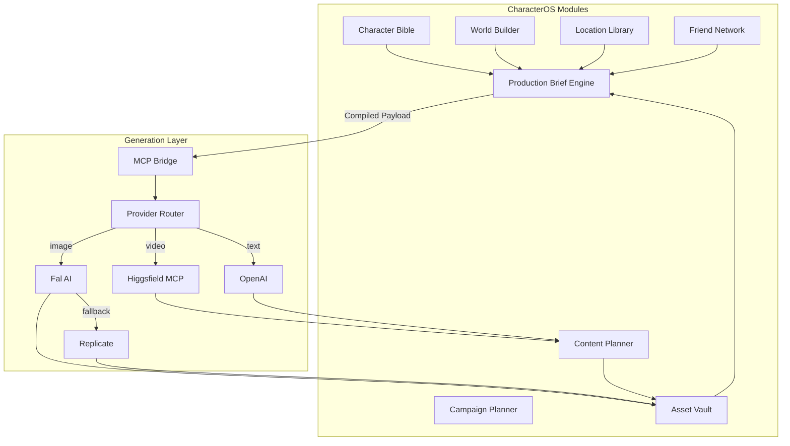

# CharacterOS — Module Architecture

**Version:** 1.0.0  
**Status:** Architecture (backend stubs in place)  
**Last Updated:** 2026-06-14

---

## 1. Overview

CharacterOS is organized into **eight product modules** plus a shared **Generation** layer. Each module owns a slice of the world graph, exposes a service boundary under `src/lib/modules/`, and maps to one or more Prisma entities.

```
CharacterOS
├ Character Bible          → CharacterBible (+ Character identity)
├ World Builder            → World, Residence, Room
├ Location Library         → Location
├ Friend Network           → Friend, FamilyMember, Pet
├ Content Planner          → ContentIdea, Post, Reel
├ Campaign Planner         → Campaign, BrandDeal, WorldEvent
├ Asset Vault              → Asset, Prompt
└ Production Brief Engine  → ProductionBrief

              ↓

        Generation Layer
        (Higgsfield MCP + Provider Router)

              ↓

     Images / Videos / Reels
```

**Core principle:** Users express **intent**; modules supply **world memory**; the Production Brief Engine compiles a human-readable brief; Generation dispatches to providers via MCP.

See also: [Production Brief System](./PRODUCTION_BRIEF_SYSTEM.md) · [Product Architecture](./PRODUCT_ARCHITECTURE.md)

---

## 2. Module Ownership Map

| Module | Owns (business logic) | Primary Entities | Service Path |
|--------|----------------------|------------------|--------------|
| **Character Bible** | Identity, personality, lifestyle profile, bible generation | `Character`, `CharacterBible`, `Occupation`, `Routine`, `Hobby`, `Outfit` | `src/lib/modules/character-bible/` |
| **World Builder** | Home environment, residence, rooms, world bootstrap | `World`, `Residence`, `Room` | `src/lib/modules/world-builder/` |
| **Location Library** | Favorite places outside home, visit patterns | `Location` | `src/lib/modules/location-library/` |
| **Friend Network** | Social circle, family, pets | `Friend`, `FamilyMember`, `Pet` | `src/lib/modules/friend-network/` |
| **Content Planner** | Ideas, posts, reels, captions, scheduling | `ContentIdea`, `Post`, `Reel`, `ProductPromotion` | `src/lib/modules/content-planner/` |
| **Campaign Planner** | Campaigns, brand deals, calendar events | `Campaign`, `BrandDeal`, `WorldEvent` | `src/lib/modules/campaign-planner/` |
| **Asset Vault** | Media storage, prompts, visual consistency | `Asset`, `Prompt` | `src/lib/modules/asset-vault/` |
| **Production Brief Engine** | Intent → brief → compiled payloads | `ProductionBrief` | `src/lib/modules/production-brief-engine/` |
| **Generation** | MCP bridge, provider routing, job dispatch | `GenerationJob` | `src/lib/modules/generation/` |

### Cross-cutting concerns (not modules)

| Concern | Location | Notes |
|---------|----------|-------|
| Database | `src/lib/db/prisma.ts` | Shared Prisma client |
| Validators | `src/lib/validators/` | Zod schemas per domain |
| Types | `src/types/` | Shared TypeScript interfaces |
| Context Builder | `production-brief-engine/context-builder.ts` | Loads world memory for any generation |

---

## 3. Entity Mapping (Module → Prisma)

```
Character (root — owned by Character Bible for identity)
    │
    ├── CharacterBible          ← Character Bible
    ├── Occupation, Routine, Hobby, Outfit  ← Character Bible (lifestyle)
    │
    └── World                     ← World Builder
            ├── Residence, Room   ← World Builder
            ├── Location          ← Location Library
            ├── Friend, FamilyMember, Pet  ← Friend Network
            └── WorldEvent        ← Campaign Planner

Character (content outputs)
    ├── Campaign, BrandDeal       ← Campaign Planner
    ├── ContentIdea, Post, Reel   ← Content Planner
    ├── Asset, Prompt             ← Asset Vault
    ├── ProductionBrief           ← Production Brief Engine
    └── GenerationJob             ← Generation
```

**Rule:** A module may *read* entities owned by other modules (via Context Builder or explicit service calls) but only *writes* its own entities.

---

## 4. Module Descriptions

### 4.1 Character Bible

**Purpose:** Canonical identity and lifestyle profile for AI context injection.

**Responsibilities:**
- Create/update `Character` records
- Generate and version `CharacterBible` (identity, personality, fashion, lifestyle JSON)
- Manage `Occupation`, `Routine`, `Hobby`, `Outfit` as lifestyle extensions
- Supply personality traits for mood resolution in Production Brief Engine

**Key prompts:** `character-generation.md`, `character-bible.md`, `lifestyle-generation.md`

**Does not own:** World geography, locations, friends, or generated media.

---

### 4.2 World Builder

**Purpose:** The moat — persistent home environment.

**Responsibilities:**
- Bootstrap `World` from character + bible context
- Generate `Residence` (type, neighborhood, interior style)
- Generate `Room[]` with design details and canonical prompts
- Mark `World.isComplete` when generation finishes

**Key prompts:** `world-generation.md`, room generation templates

**Does not own:** External locations (Location Library) or social graph (Friend Network).

---

### 4.3 Location Library

**Purpose:** Favorite places outside the home — cafes, gyms, offices, travel spots.

**Responsibilities:**
- CRUD for `Location` entities scoped to a `World`
- Link locations to `Routine`, `WorldEvent`, `ContentIdea`
- Maintain visit frequency and favorite flags
- Trigger location image generation (via Generation → Fal)

**Key prompts:** `location-creation.md`

---

### 4.4 Friend Network

**Purpose:** Social circle that grounds relationship-driven content.

**Responsibilities:**
- CRUD for `Friend`, `FamilyMember`, `Pet`
- Portrait generation for friends (via Generation)
- Feed social summaries into Character Bible updates

**Key prompts:** `friend-creation.md`

---

### 4.5 Content Planner

**Purpose:** Planned and generated social content pieces.

**Responsibilities:**
- Generate `ContentIdea[]` from world context and campaigns
- Materialize ideas into `Post` and `Reel` after generation
- Caption and hashtag generation (via Generation → OpenAI)
- Link outputs back to `ProductionBrief` and `Asset`

**Key prompts:** `content-calendar.md`, `instagram-caption.md`, `hashtag-generation.md`, `trending-reel.md`

---

### 4.6 Campaign Planner

**Purpose:** Time-bound content strategy and brand moments.

**Responsibilities:**
- CRUD for `Campaign` (weekly, monthly, seasonal, brand)
- Manage `BrandDeal` partnerships
- Schedule `WorldEvent` calendar hooks that spawn `ContentIdea`
- Batch content planning across date ranges

**Key prompts:** `content-calendar.md`, `product-promotion.md`

---

### 4.7 Asset Vault

**Purpose:** Universal media vault and visual consistency layer.

**Responsibilities:**
- Store and tag `Asset` records (images, videos, LoRAs, workflows)
- Maintain `Prompt` recipes as visual DNA for rooms, locations, outfits
- Resolve canonical prompts for Production Brief Engine
- Upload to Supabase Storage; index by location, room, campaign

---

### 4.8 Production Brief Engine

**Purpose:** Translate user intent into human-readable briefs — no prompt engineering.

**Responsibilities:**
- Parse preset and natural-language intents
- Assemble `ProductionBrief` from world memory (location, wardrobe, mood, camera)
- Compile briefs into provider payloads (hidden from user)
- Track brief status: `DRAFT → APPROVED → GENERATING → COMPLETED`

**Pipeline stages:**
1. **Intent Parser** — button click or NL → `ParsedIntent`
2. **Context Builder** — load Character → World → Content graph
3. **Brief Assembler** — resolve location, wardrobe, mood, camera, duration
4. **Prompt Compiler** — brief + context → `CompiledGenerationPayload`

See [PRODUCTION_BRIEF_SYSTEM.md](./PRODUCTION_BRIEF_SYSTEM.md) for full specification.

---

### 4.9 Generation Layer

**Purpose:** Provider-agnostic dispatch to external AI APIs via MCP.

**Responsibilities:**
- Route requests by type (text, image, video, caption)
- Primary video path: **Higgsfield MCP**
- Fallback/alternative providers per type
- Track `GenerationJob` status and credit usage
- Persist outputs to Asset Vault and Content Planner

**Not a product module** — infrastructure consumed by all modules that trigger generation.

---

## 5. Generation Pipeline

### 5.1 End-to-end flow

```
User Intent ("Generate Monday Morning Reel")
        │
        ▼
┌───────────────────────────────────────┐
│     Production Brief Engine           │
│  Intent → Context → Brief → Compile   │
└───────────────────┬───────────────────┘
                    │ CompiledGenerationPayload
                    ▼
┌───────────────────────────────────────┐
│         Generation Layer              │
│  MCP Bridge → Provider Router         │
└───────────────────┬───────────────────┘
                    │
        ┌───────────┼───────────┐
        ▼           ▼           ▼
    Script       Thumbnail      Video
   (OpenAI)       (Fal)     (Higgsfield MCP)
        │           │           │
        └───────────┴───────────┘
                    │
                    ▼
        Content Planner + Asset Vault
        (Reel, Post, Asset persisted)
```

### 5.2 Provider routing

| Generation Type | Primary (Provider #1) | Fallback / Alternative |
|-----------------|-------------------------|------------------------|
| **Video / Reel** | **Higgsfield MCP** | Veo, Kling, Runway |
| **Image** | Fal AI | Replicate |
| **Script / Caption / Hashtags** | OpenAI GPT-5 | Anthropic Claude |
| **Bible / World / Ideas (text)** | OpenAI GPT-5 | Anthropic Claude |

**Higgsfield MCP** is the canonical video path. The Generation layer wraps Higgsfield as an MCP-compatible adapter (`src/lib/modules/generation/providers/higgsfield.provider.ts`) so provider swaps require config changes, not module rewrites.

### 5.3 MCP tools (Generation Bridge)

| Tool | Provider | Used By |
|------|----------|---------|
| `generate_video` | Higgsfield → Veo → Kling | Production Brief Engine |
| `generate_image` | Fal → Replicate | Asset Vault, World Builder, Location Library |
| `generate_script` | OpenAI → Anthropic | Production Brief Engine |
| `generate_caption` | OpenAI → Anthropic | Content Planner |
| `generate_hashtags` | OpenAI → Anthropic | Content Planner |
| `assemble_brief` | Internal | Production Brief Engine |

---

## 6. Architecture Diagrams

### 6.1 Module dependency (ASCII)

```
                    ┌─────────────────┐
                    │  Character Bible │
                    └────────┬────────┘
                             │
              ┌──────────────┼──────────────┐
              ▼              ▼              ▼
     ┌─────────────┐  ┌─────────────┐  ┌─────────────┐
     │World Builder│  │Location Lib │  │Friend Network│
     └──────┬──────┘  └──────┬──────┘  └──────┬──────┘
            │                │                │
            └────────────────┼────────────────┘
                             ▼
                    ┌─────────────────┐
                    │ Campaign Planner │
                    └────────┬────────┘
                             │
                             ▼
                    ┌─────────────────┐
                    │ Content Planner  │
                    └────────┬────────┘
                             │
              ┌──────────────┴──────────────┐
              ▼                             ▼
     ┌─────────────────┐          ┌─────────────────┐
     │Production Brief │          │   Asset Vault   │
     │     Engine      │◀────────▶│                 │
     └────────┬────────┘          └─────────────────┘
              │
              ▼
     ┌─────────────────┐
     │   Generation    │
     │ Higgsfield MCP  │
     │ + Provider Router│
     └────────┬────────┘
              ▼
        Images / Videos / Reels
```

### 6.2 Generation pipeline (Mermaid)



---

## 7. Worked Example: Mimi "Monday Morning Reel"

### 7.1 World memory (pre-existing)

| Field | Value | Module | Entity |
|-------|-------|--------|--------|
| Name | Mimi | Character Bible | `Character` |
| City / Home | Powai | World Builder | `World`, `Residence` |
| Morning room | Bedroom | World Builder | `Room` |
| Personality | Playful, Luxury, Feminine | Character Bible | `CharacterBible.personality` |
| Wardrobe | Oversized Beige Sweater | Character Bible | `Outfit` |
| Morning routine | Coffee ritual at home | Character Bible | `Routine` |

### 7.2 User action

```
[ Generate Monday Morning Reel ]
```

One click — no prompt box.

### 7.3 Module interactions

```
1. Production Brief Engine
   ├── Intent Parser → { type: REEL, scene: "morning", day: "monday" }
   ├── Context Builder → loads Character Bible + World Builder + Asset Vault refs
   ├── Brief Assembler → ProductionBrief (human-readable)
   └── User reviews → [ Generate ]

2. Production Brief Engine (compile)
   └── Prompt Compiler → CompiledGenerationPayload

3. Generation Layer (parallel where possible)
   ├── generate_script  → OpenAI        → 15s scene breakdown
   ├── generate_image   → Fal AI        → thumbnail (9:16)
   ├── generate_video   → Higgsfield MCP → final reel
   ├── generate_caption → OpenAI        → Instagram caption
   └── generate_hashtags→ OpenAI        → hashtag set

4. Content Planner
   ├── Create ContentIdea (status: GENERATED)
   └── Create Reel (videoUrl, script, caption, hashtags)

5. Asset Vault
   ├── Persist thumbnail Asset
   └── Persist video Asset

6. Production Brief Engine
   └── Update ProductionBrief.status = COMPLETED
```

### 7.4 Production Brief (user-visible)

```yaml
Production Brief
─────────────────────────────────
Character:   Mimi
Location:    Powai Apartment — Bedroom
Scene:       Monday Morning
Wardrobe:    Oversized Beige Sweater
Mood:        Cozy Luxury
Camera:      Handheld Lifestyle Vlog
Platform:    Instagram Reel
Duration:    15 sec
─────────────────────────────────
Status: Ready to Generate
```

### 7.5 Hidden compile → Higgsfield

The Prompt Compiler produces a video payload dispatched to Higgsfield MCP:

```json
{
  "provider": "higgsfield",
  "prompt": "Handheld lifestyle vlog, Mimi waking up in Powai apartment bedroom, oversized beige sweater, morning golden light, cozy luxury mood, vertical 9:16, 15 seconds",
  "parameters": { "duration": 15, "aspectRatio": "9:16", "style": "UGC" }
}
```

The user never sees this prompt.

---

## 8. Module → API Route Mapping (planned)

| Module | API prefix |
|--------|------------|
| Character Bible | `/api/v1/characters`, `/api/v1/characters/:id/bible` |
| World Builder | `/api/v1/characters/:id/world` |
| Location Library | `/api/v1/characters/:id/world/locations` |
| Friend Network | `/api/v1/characters/:id/world/friends` |
| Content Planner | `/api/v1/characters/:id/content` |
| Campaign Planner | `/api/v1/characters/:id/campaigns` |
| Asset Vault | `/api/v1/characters/:id/assets` |
| Production Brief Engine | `/api/v1/characters/:id/briefs` |
| Generation | `/api/v1/jobs/:jobId` |

See [API Contracts](../api/API_CONTRACTS.md) for full specifications.

---

## 9. Implementation Status

| Module | Schema | Types | Validators | Service | AI Layer |
|--------|--------|-------|------------|---------|----------|
| Character Bible | ✅ | ✅ | ✅ | ✅ `services/` | — |
| World Builder | ✅ | ✅ | ✅ | ✅ `services/world` | — |
| Location Library | ✅ | ✅ | ✅ | ✅ via world service | — |
| Friend Network | ✅ | ✅ | ✅ | ✅ via world service | — |
| Content Planner | ✅ | — | — | stub | — |
| Campaign Planner | ✅ | — | — | stub | — |
| Asset Vault | ✅ | — | — | stub | — |
| Production Brief Engine | ✅ | ✅ | ✅ | ✅ `services/` | ✅ `ai/brief-assembler` |
| Generation | ✅ | ✅ | — | — | ✅ `ai/generation-router`, `ai/mcp` |

---

## 10. Related Documents

| Document | Path |
|----------|------|
| Product Architecture | `docs/architecture/PRODUCT_ARCHITECTURE.md` |
| Production Brief System | `docs/architecture/PRODUCTION_BRIEF_SYSTEM.md` |
| Folder Structure | `docs/architecture/FOLDER_STRUCTURE.md` |
| ER Diagram | `docs/architecture/ER_DIAGRAM.md` |
| Prisma Schema | `prisma/schema.prisma` |
| API Contracts | `docs/api/API_CONTRACTS.md` |
